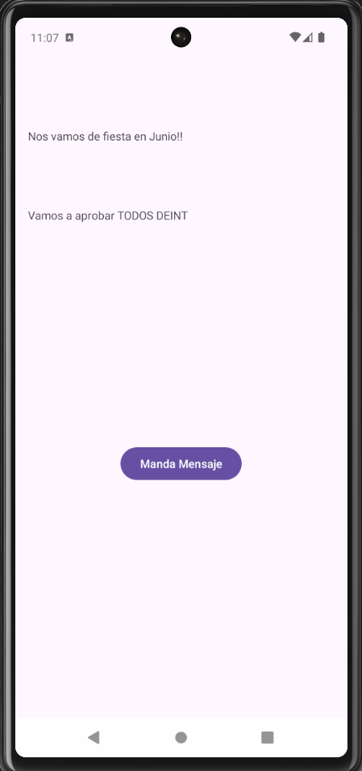

# Hello World App

## Contenidos Aprendidos

En este proyecto, se han cubierto los siguientes conceptos clave del desarrollo en Android:

1. **Añadir dependencias al proyecto**: Se aprendió a gestionar las dependencias necesarias en el archivo `build.gradle` para incorporar bibliotecas externas y funcionalidades adicionales en el proyecto.

2. **Crear un layout en XML**: Se diseñó una interfaz de usuario en XML que incluye dos elementos de texto y un botón. Se trabajó con las vistas ([TextView](https://developer.android.com/reference/android/widget/TextView?hl=en) y [Button](https://developer.android.com/reference/android/widget/Button?hl=en)) y se estructuró el layout utilizando diferentes atributos y restricciones para garantizar una interfaz amigable para el usuario.

3. **Sincronizar el proyecto con Firebase**: Se integró Firebase al proyecto para habilitar diferentes servicios como Analytics, Firestore, o autenticación de usuarios. Incluye la configuración de dependencias y la sincronización del proyecto con Firebase.

4. **Crear una excepción con `throws`**: Se abordó el manejo de excepciones mediante el uso de `throws`. Este enfoque se utilizó para indicar que un método específico podría lanzar una excepción, mejorando la gestión de errores en la aplicación.

5. **Utilizar el registro de sucesos LogCat**: Se utilizó `LogCat` para registrar sucesos durante la ejecución de la aplicación, ayudando en el proceso de depuración y monitoreo del comportamiento de la aplicación. Se aprendió a utilizar los niveles de log como [Log.d](https://developer.android.com/reference/android/util/Log?hl=en#d(java.lang.String,%20java.lang.String)), [Log.e](https://developer.android.com/reference/android/util/Log?hl=en#e(java.lang.String,%20java.lang.String)), [Log.i](https://developer.android.com/reference/android/util/Log?hl=en#i(java.lang.String,%20java.lang.String)), entre otros, para proporcionar diferentes tipos de información.

6. **Generar la documentación en formato HTML**: Se generó documentación del código utilizando [Dokka](https://kotlinlang.org/docs/dokka-get-started.html), la herramienta de documentación para Kotlin. La documentación se encuentra en la carpeta `documentation/html/` y contiene enlaces internos, enlaces externos a [Android Developers](https://developer.android.com) y utiliza formato Markdown.

7. **Inicialización tardía (`lateinit`) y perezosa (`by lazy`)**: Se estudió el uso de `lateinit` y `by lazy` en Kotlin. `lateinit` permite inicializar propiedades no nulas después de la declaración, mientras que `by lazy` permite la inicialización perezosa de una propiedad solo cuando se utiliza por primera vez, optimizando así el uso de recursos.


## Instalación y configuración
Para ejecutar este proyecto, necesitarás:

1. Android Studio.
2. Clonar este repositorio en tu máquina local usando `git clone URL_DEL_REPOSITORIO`.
3. Abrir el proyecto en Android Studio.

## Ejecución
Para ejecutar la aplicación en un emulador o dispositivo físico:

1. Abre el proyecto en Android Studio.
2. Ejecuta el proyecto usando 'Run > Run 'app''.
3. La aplicación debería iniciar en el dispositivo o emulador seleccionado mostrando los mensajes configurados.

## Estructura del proyecto
El proyecto contiene las siguientes partes clave:

- `MainActivity.kt`: Clase que extiende `AppCompatActivity` y configura los mensajes de `TextView`.
- `activity_main.xml`: Archivo XML que define la UI de la aplicación.
- `colors.xml` y `strings.xml`: Archivos de recursos que definen los colores y cadenas utilizadas en la aplicación.
- `documentation/html/`: Documentación generada por Dokka en formato HTML.

## Documentación
La documentación del proyecto se ha generado con [Dokka](https://kotlinlang.org/docs/dokka-get-started.html) y está disponible en `documentation/html/`. Para regenerar la documentación:

```bash
./gradlew dokkaHtml
```

La documentación incluye:
- Etiquetas HTML para estructura
- Enlaces internos entre clases y métodos
- Enlaces externos a [Android Developers](https://developer.android.com)
- Formato Markdown para estilos

## Imagen de la Aplicación



## Autora
 Lourdes Rodríguez Morón :tada:

## Versión
1.0

## Licencia
Este proyecto está licenciado bajo la [Licencia MIT](https://opensource.org/licenses/MIT). Consulta el archivo `LICENSE` para más detalles.OCESSES": "true",
    "SONARLINT_PRECOMMIT_ANALYSIS": "true",
    "cf.first.check.clang-format": "false",
    "cidr.known.project.marker": "true",
    "com.google.services.firebase.aqiPopupShown": "true",
    "dart.analysis.tool.window.visible": "false",
    "device.streaming.spark.single.device.do.not.ask": "true",
    "git-widget-placeholder": "main",
    "kotlin-language-version-configured": "true",
    "last_opened_file_path": "/home/lourdes/pCloudDrive/Clases/JETPACK/1. Introduccion Android/ejercicios_clase/HelloWorldCompose",
    "project.structure.last.edited": "Modules",
    "project.structure.proportion": "0.17",
    "project.structure.side.proportion": "0.2",
    "settings.editor.selected.configurable": "preferences.pluginManager",
    "show.migrate.to.gradle.popup": "false"
  }
}]]></component>
  <component name="PsdUISettings">
    <option name="MODULE_TAB" value="Default Config" />
    <option name="LAST_EDITED_SIGNING_CONFIG" value="debug" />
  </component>
  <component name="RunManager">
    <configuration name="app" type="AndroidRunConfigurationType" factoryName="Android App" activateToolWindowBeforeRun="false">
      <module name="HelloWorldKotlin.app" />
      <option name="ANDROID_RUN_CONFIGURATION_SCHEMA_VERSION" value="1" />
      <option name="DEPLOY" value="true" />
      <option name="DEPLOY_APK_FROM_BUNDLE" value="false" />
      <option name="DEPLOY_AS_INSTANT" value="false" />
      <option name="ARTIFACT_NAME" value="" />
      <option name="PM_INSTALL_OPTIONS" value="" />
      <option name="ALL_USERS" value="false" />
      <option name="ALWAYS_INSTALL_WITH_PM" value="false" />
      <option name="ALLOW_ASSUME_VERIFIED" value="false" />
      <option name="CLEAR_APP_STORAGE" value="false" />
      <option name="DYNAMIC_FEATURES_DISABLED_LIST" value="" />
      <option name="ACTIVITY_EXTRA_FLAGS" value="" />
      <option name="MODE" value="default_activity" />
      <option name="RESTORE_ENABLED" value="false" />
      <option name="RESTORE_FILE" value="" />
      <option name="RESTORE_FRESH_INSTALL_ONLY" value="false" />
      <option name="CLEAR_LOGCAT" value="false" />
      <option name="SHOW_LOGCAT_AUTOMATICALLY" value="false" />
      <option name="TARGET_SELECTION_MODE" value="DEVICE_AND_SNAPSHOT_COMBO_BOX" />
      <option name="DEBUGGER_TYPE" value="Auto" />
      <Auto>
        <option name="USE_JAVA_AWARE_DEBUGGER" value="false" />
        <option name="SHOW_STATIC_VARS" value="true" />
        <option name="WORKING_DIR" value="" />
        <option name="TARGET_LOGGING_CHANNELS" value="lldb process:gdb-remote packets" />
        <option name="SHOW_OPTIMIZED_WARNING" value="true" />
        <option name="ATTACH_ON_WAIT_FOR_DEBUGGER" value="false" />
      </Auto>
      <Hybrid>
        <option name="USE_JAVA_AWARE_DEBUGGER" value="false" />
        <option name="SHOW_STATIC_VARS" value="true" />
        <option name="WORKING_DIR" value="" />
        <option name="TARGET_LOGGING_CHANNELS" value="lldb process:gdb-remote packets" />
        <option name="SHOW_OPTIMIZED_WARNING" value="true" />
        <option name="ATTACH_ON_WAIT_FOR_DEBUGGER" value="false" />
      </Hybrid>
      <Java>
        <option name="ATTACH_ON_WAIT_FOR_DEBUGGER" value="false" />
      </Java>
      <Native>
        <option name="USE_JAVA_AWARE_DEBUGGER" value="false" />
        <option name="SHOW_STATIC_VARS" value="true" />
        <option name="WORKING_DIR" value="" />
        <option name="TARGET_LOGGING_CHANNELS" value="lldb process:gdb-remote packets" />
        <option name="SHOW_OPTIMIZED_WARNING" value="true" />
        <option name="ATTACH_ON_WAIT_FOR_DEBUGGER" value="false" />
      </Native>
      <Profilers>
        <option name="ADVANCED_PROFILING_ENABLED" value="false" />
        <option name="STARTUP_PROFILING_ENABLED" value="false" />
        <option name="STARTUP_CPU_PROFILING_ENABLED" value="false" />
        <option name="STARTUP_CPU_PROFILING_CONFIGURATION_NAME" value="Java/Kotlin Method Sample (legacy)" />
        <option name="STARTUP_NATIVE_MEMORY_PROFILING_ENABLED" value="false" />
        <option name="NATIVE_MEMORY_SAMPLE_RATE_BYTES" value="2048" />
      </Profilers>
      <option name="DEEP_LINK" value="" />
      <option name="ACTIVITY" value="" />
      <option name="ACTIVITY_CLASS" value="" />
      <option name="SEARCH_ACTIVITY_IN_GLOBAL_SCOPE" value="false" />
      <option name="SKIP_ACTIVITY_VALIDATION" value="false" />
      <method v="2" />
    </configuration>
  </component>
  <component name="SpellCheckerSettings" RuntimeDictionaries="0" Folders="0" CustomDictionaries="0" DefaultDictionary="application-level" UseSingleDictionary="true" transferred="true" />
  <component name="StandaloneScriptsStorage">
    <option name="files">
      <set>
        <option value="$PROJECT_DIR$/build.gradle.kts" />
      </set>
    </option>
  </component>
  <component name="TaskManager">
    <task active="true" id="Default" summary="Default task">
      <changelist id="9aee53ed-66b9-4323-b77c-a5d39a2ae854" name="Changes" comment="" />
      <created>1727785572162</created>
      <option name="number" value="Default" />
      <option name="presentableId" value="Default" />
      <updated>1727785572162</updated>
    </task>
    <task id="LOCAL-00001" summary="Iconos en el README.md">
      <option name="closed" value="true" />
      <created>1728423503100</created>
      <option name="number" value="00001" />
      <option name="presentableId" value="LOCAL-00001" />
      <option name="project" value="LOCAL" />
      <updated>1728423503100</updated>
    </task>
    <task id="LOCAL-00002" summary="Versión final iconos de README">
      <option name="closed" value="true" />
      <created>1728424754582</created>
      <option name="number" value="00002" />
      <option name="presentableId" value="LOCAL-00002" />
      <option name="project" value="LOCAL" />
      <updated>1728424754582</updated>
    </task>
    <option name="localTasksCounter" value="3" />
    <servers />
  </component>
  <component name="Vcs.Log.Tabs.Properties">
    <option name="RECENT_FILTERS">
      <map>
        <entry key="User">
          <value>
            <list>
              <RecentGroup>
                <option name="FILTER_VALUES">
                  <option value="*" />
                </option>
              </RecentGroup>
            </list>
          </value>
        </entry>
      </map>
    </option>
    <option name="TAB_STATES">
      <map>
        <entry key="MAIN">
          <value>
            <State>
              <option name="CUSTOM_BOOLEAN_PROPERTIES">
                <map>
                  <entry key="Show.Git.Branches" value="true" />
                </map>
              </option>
              <option name="FILTERS">
                <map>
                  <entry key="branch">
                    <value>
                      <list>
                        <option value="origin/main" />
                      </list>
                    </value>
                  </entry>
                  <entry key="user">
                    <value>
                      <list>
                        <option value="*" />
                      </list>
                    </value>
                  </entry>
                </map>
              </option>
            </State>
          </value>
        </entry>
      </map>
    </option>
  </component>
  <component name="VcsManagerConfiguration">
    <option name="ADD_EXTERNAL_FILES_SILENTLY" value="true" />
    <MESSAGE value="Iconos en el README.md" />
    <MESSAGE value="Versión final iconos de README" />
    <option name="LAST_COMMIT_MESSAGE" value="Versión final iconos de README" />
  </component>
  <component name="XDebuggerManager">
    <breakpoint-manager>
      <breakpoints>
        <line-breakpoint enabled="true" type="kotlin-line">
          <condition expression="message==&quot;Hola Mundo&quot;" language="kotlin" />
          <url>file://$PROJECT_DIR$/app/src/main/java/com/moronlu18/helloworldkotlin/MainActivity.kt</url>
          <line>62</line>
          <option name="timeStamp" value="14" />
        </line-breakpoint>
      </breakpoints>
    </breakpoint-manager>
  </component>
  <component name="play_dynamic_filters_status">
    <option name="appIdToCheckInfo">
      <map>
        <entry key="com.moronlu18.helloworldkotlin">
          <value>
            <CheckInfo lastCheckTimestamp="1781454262142" />
          </value>
        </entry>
        <entry key="com.moronlu18.helloworldkotlin.test">
          <value>
            <CheckInfo lastCheckTimestamp="1781454262126" />
          </value>
        </entry>
      </map>
    </option>
  </component>
</project>